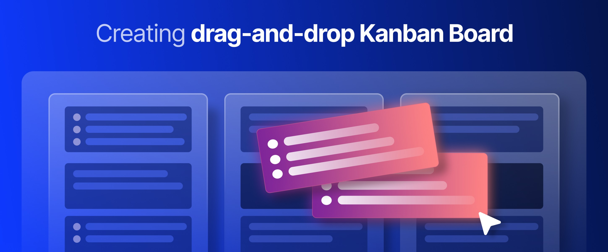

# Kanban Board Project

This project is a simple Kanban board implemented using Vue.js and vue-dragula for drag-and-drop functionality. The board consists of columns such as "To Do," "In Progress," and "Done," allowing you to manage tasks efficiently.



## Getting Started

Follow these steps to run the Kanban board locally:

### Prerequisites

- Web browser
- Python (for serving the HTML file locally)

### Installation

1. Clone the repository:

   ```bash
   git clone <repository_url>

## Built With

Vue.js - JavaScript framework for building user interfaces.
vue-dragula - Vue wrapper for the drag-and-drop library Dragula.

## Contributing
Contributions are welcome! Feel free to open issues or submit pull requests.

## License
This project is licensed under the MIT License - see the LICENSE file for details.
